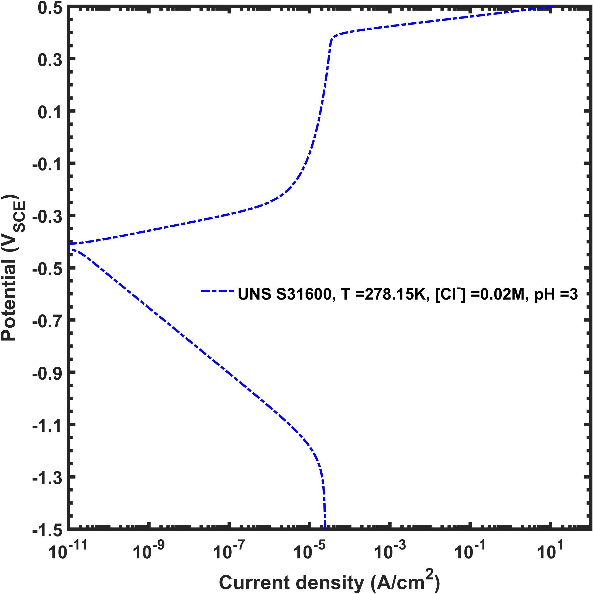
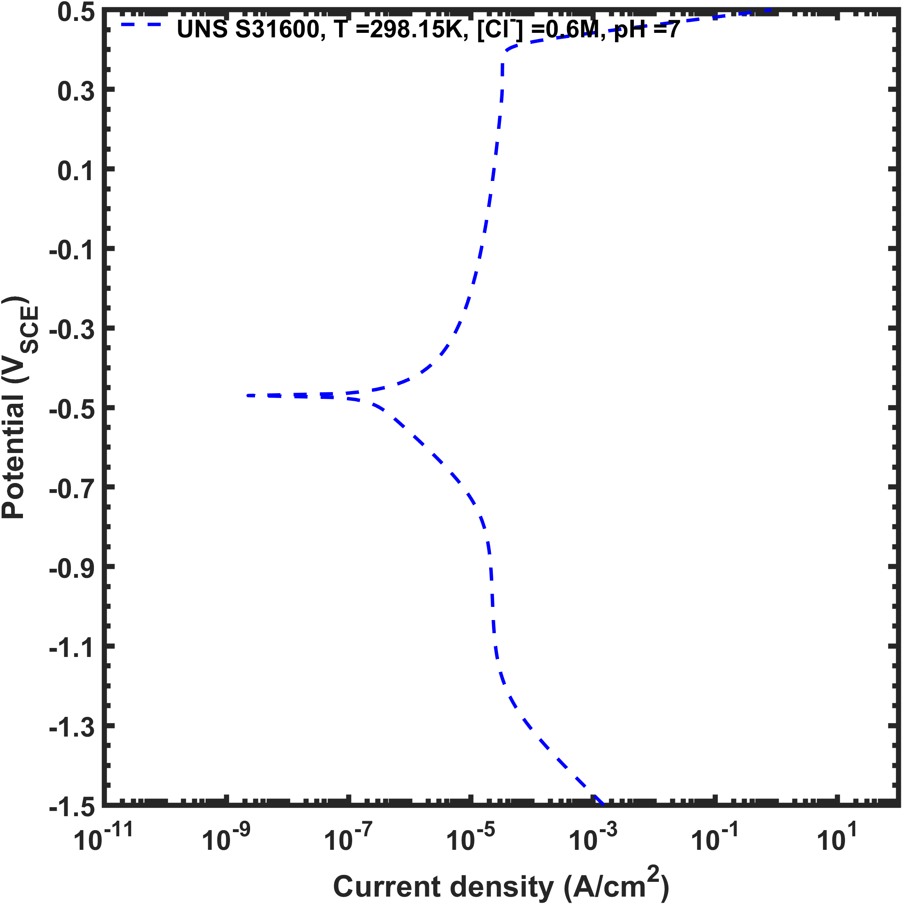
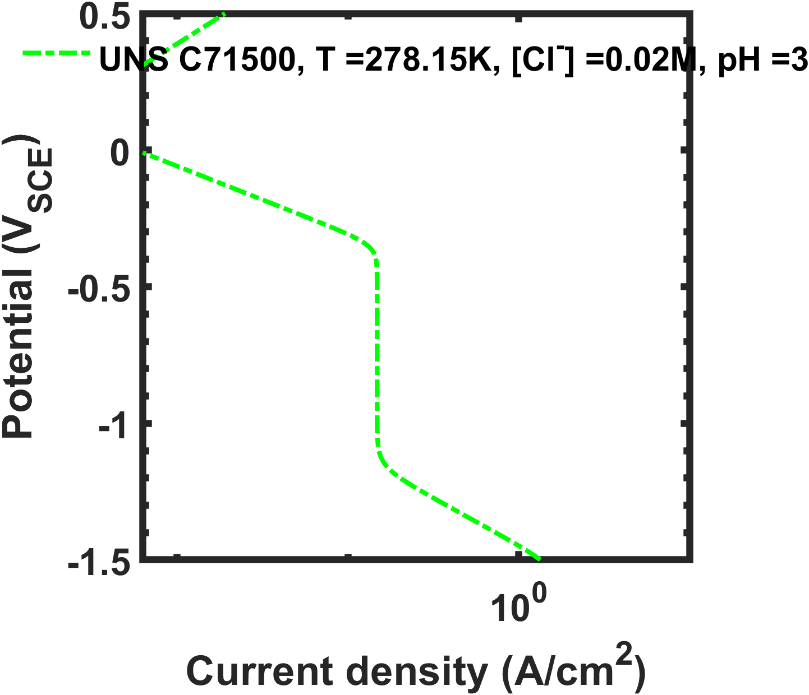
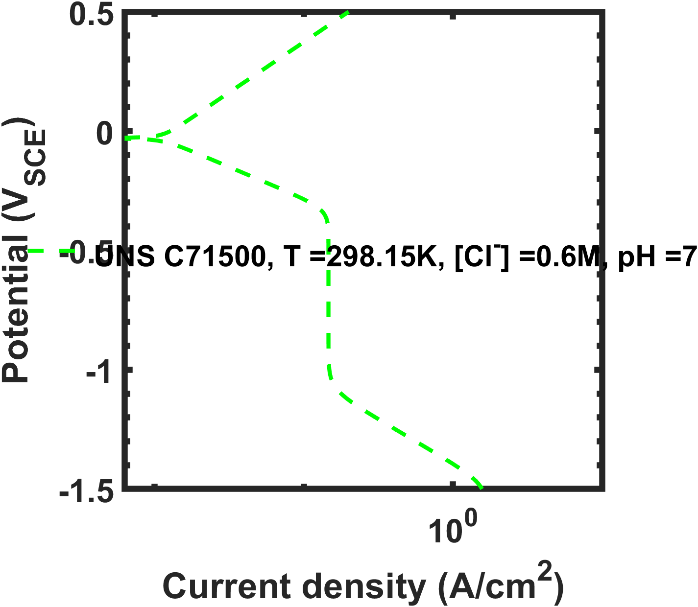
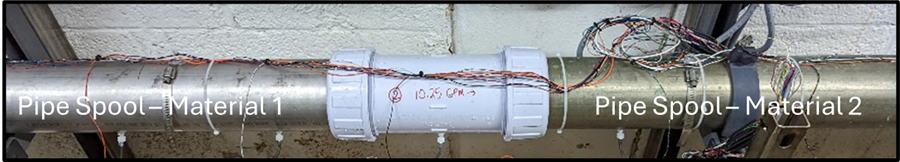
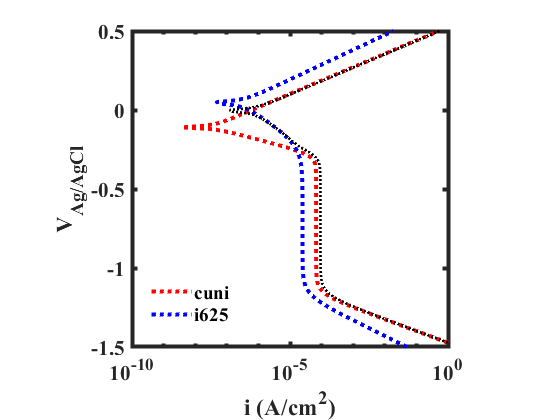
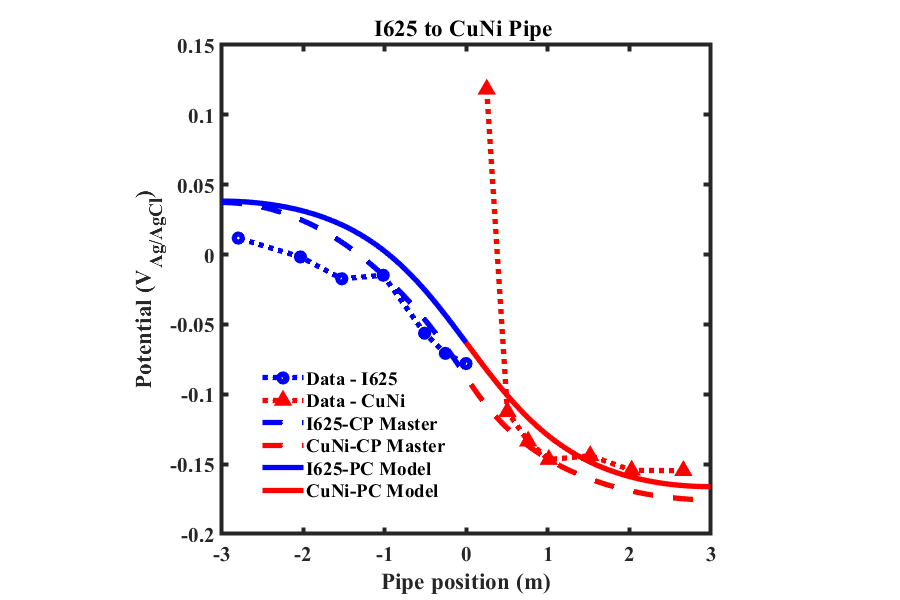

# Corrosion Modeling and Analysis Applications
Serves as a repository for multiple applications related to corrosion modeling and analysis of experimental data.

---

## 1. EIS Data Analysis
This project (found in the eis-analysis folder) was developed to facilitate the analysis of electrochemical impedance spectroscopy (EIS) data obtained from potentiostatic EIS experiments.

**Note:** The code has not been tested to determine if it works with galvanostatic EIS data.

The main function depends on files contained in the following sub-directories:

*	"Circuit Element Models"
*	"Equivalent Circuit Models"
*	"Fitting Algorithms"

Data files are expected to be found in a "Data" directory. Fit results are stored in a "Fit" directory.
All functions and classes are written in MATLAB®.

### Main Function
This function serves as the entry point for the project to analyze and fit EIS data. It can be customized depending on the physical system the EIS data was collected from, but it needs to perform the following actions:

*	Clear the command window, all figures, and all variables from the workspce.
*	Add the paths to the sub-directories containing the functions for the equivalent circuit impedance calculations and other supporting classes.
*	Create a cell array of data filenames
*	Iterate through the filenames to extract the impedance data.
*	Instantiate an instance of the eisFitController class for each datafile, pass the data to the constructor as well as the equivalent circuit type, and initial guess of the fit parameter values

Definitions for the variables in the Main function are provided below:

*	datafilenames = cell arrray containinng filenames of the raw Gamry data files
*	selectedEquivalentCircuit = character vector specifying the equivalent circuit to be used to fit the data. Available circuits are listed in the following sub-section
*	vectorOfInitialParameterEstimates = array of values for the initial parameter estimates
*	legendString = character array of the descriptions of the data to be plotted on the output plots

Available Equivalent Circuits:
Use Table 1 to specify the equivalent circuit impedance function to use in the fitting routine.  In the provided code example, it can be seen that ‘ModifiedRandles’ was the circuit that was selected.

Table 1. Available equivalent circuit impedance functions for fitting to EIS data.  The 2nd column lists the value for the selectedEquivalentCircuit class instance that is created for each datafile.  The 3rd column lists the number of initial parameter values that must be passed to the fitting function.

|Circuit Name|Name to pass to the EISFitController Instance|Number of fit parameters needed in vector|
|---|---|---|
Undamaged Coating|UndamagedCoating|3|
|Modified Undamaged Coating|ModifiedUndamagedCoating|4|
|Randles|Randles|5|
|Modified Randles|ModifiedRandles|6|
|Nested Randles Coating Defect|NestedRandlesCoatingDefect|5|
|Rapid Electrochemical Assessment of Paint (REAP)|REAP|6|
|Modified REAP|ModifiedREAP|7|

Examples of the output text with the fit parameter values and a Bode plot of the EIS data and fit are shown in Figure 1a and Figure 1b, respectively.

|a|b|
|---|---|
|||

_Figure 1. a._ Example output from the fitting routine. _b._ Bode plot of the impedance modulus vs potential oscillation frequency and the phase of the response vs the potential oscillation frequency.  Open symbols indicate data, the line indicates the fit.

### Principal Supporting Functions and Classes
#### eisFitController

This function calls the specified equivalent circuit model that will fit the data and passes the initial parameter set estimate to the fitting function. It also establishes the constratint limts on the fit parameters for the simplex algorithm and calls the fitting function. Lastly, it stores the results of the fit in output files. Fit parameter values are output to the command window.

_Function inputs_

* T = instance of eisdata class
* fType = name of the equivalent circuit model to be used to analyze the data
* beta0 = array of values for the initial guess for the fit
* fitDirectory = directory where fit results are stored
* legendForPlotString = string of descriptions for the data on the plot

_Function outputs_

* Files with fit values and list of fit parameters to the command window

---

## 2. Polarization Curve Modeling
Using this code (found in the polarization-curve-modeling folder), polarization curves can be obtained across a range of temperatures, concentrations, pH values, and electrolyte flow velocities. Note, though, that the simplified nature of the polarization curves obtained from this modeling approach arises becuase these are intended to serve as boundary conditions for FEM of complex parts and components exposed to corrosive environments. The BCs on the electrode surfaces in those calculations are restricted to single-valued functions. Thus, observed polarization behavior that results in active-passive transitions, for example, will not be captured by these models.

### Main Function
Unlike the classes that are described in the following section, the main function is not unique.  It serves as the entry point to the code for modeling a polarization curve. Whatever this function is named, however, it must accomplish the following actions:

*	Clear the command window, all figures, and all variables from the workspace.
*	Instantiate an instance of the Constants class.
*	Define the potential region of interest
*	Define the various environmental conditions for generating the polarization curves
*	Iterate through the environmental conditions to construct instances of the PolarizationCurveModel class and call the plotting function for the defined polarization curves.

Two examples of the polarization curves for the same material but with different environmental conditions that can be generated are shown in Figure 2.

|a|b|
|---|---|
|||
|c|d|
|||

_Figure 2. a._ Modeled polarization curve for a 316 stainless steel in 0.02 M NaCl solution at 5oC, pH = 3, and a flow velocity of 5 m/s. _b._ Modeled polarization curve for a 316 stainless steel in 0.6 M NaCl solution at 25oC, pH = 7, and a flow velocity of 5 m/s. _c._ Modeled polarization curve for a CuNi 70-30 alloy in 0.02 M NaCl solution at 5oC, pH = 3, and a flow velocity of 5 m/s. _d._ Modeled polarization curve for a CuNi 70-30 alloy in 0.6 M NaCl solution at 25oC, pH = 7, and a flow velocity of 5 m/s.

### Principal Sub-Functions and Classes
The principal supporting classes and sub-functions that are used in the model include the following:

* Constants - a class that defines a number of conversion values for converting units as well as a number of physical parameters for electrochemical calculations.
* PolarizationCurveModel - a class that creates an object to calculate and plot a polarization curve.

#### Constants and Conversion Factors
This class contains variables storing physical constant values for use in electrochemical calculations.

#### Polarization Curve Class
This class serves as the template to create an object that can calculate and plot a polarization curve.
Alloys specifically included in this version of the code:

*	HY 80
*	HY 100
*	SS 316
*	Ti
* CuNi (Wrought, 70-30 alloy)
*	I625

**Note** This version of the code contains estimates for reaction properties for the alloys specified above. If additional alloys are to be considered, their model reaction properties must be included in the Polarization Curve class, or this version of the code must be changed so the values can be obtained elsewhere (see Roadmap).

---

## 3. Pipe Spool Galvanic Couple Modeling
Physics-based and response surface models (found in the pipe-spool-model folder) are used to calculate the galvanic interactions between 2 pipe spools composed of different materials and exposed to a user-specified electrolyte, as shown in Figure 3. 

||
|---|

_Figure 3._ Galvanic couple between pipe spools of different materials. 

The pipe spools are simplified to 2-dimensional interactions by assuming axial and radial symmetry. The polarization curves that are used for the electrode boundary conditions in this work were calculated using the functions and procedures developed in the "Polarization Curve Modeling" project.

### Main Function
This example function serves as the entry point to the code for modeling the galvanic interaction between two pipe spools. It must accomplish the following actions:

*	Clear the command window, all figures, and all variables from the workspace.
*	Ensure the code can find supporting classes in the respective sub-folders
*	Provide paths to the raw data and any other model results (if needed)
*	Instantiate a PipeLoopModel object
*	Define the properties of the pipe spools and the computational cell properties
*	Define the various environmental conditions for generating the polarization curves
*	Instantiate a GalvanicCorrosion object
*	Iterate through the environmental conditions to define and plot the defined polarization curves.

Examples of the polarization curve calculations for the different materials and the potential distribution are shown in  Figure 4a and Figure 4b, respectively.

|a|b|
|---|---|
|||

_Figure 4. a._ Individual polarization curves and combined galvanic corrosion response for the modeled I625 and wrought CuNi pipe spools. _b._ Comparison of the measured and modeled potential distributions for a pipe spool galvanic couple between I625 and wrought CuNi in flowing seawater.

### Principal Sub-Functions and Classes
The principal supporting classes and sub-functions that are used in the model include the following:

* PipeLoopModel - a class that contains model predictions and experimental results for comparisons.
* galvanicCorrosion - a class that contains functions for performing the potential distribution calculation for the galvanic couple between the pipe spools.

#### Pipe Loop Model
This class serves as a holding center for gathering experimental data and model outcomes from files.

#### Galvanic Corrosion Simulation
This class defines the computational cell and contains the static functions that perform the Symmetric Over-Relaxation (SOR) calculation to obtain the potential distribution by solving the Laplace equation in 2 dimensions.

---

## 4. Experimental Data Analysis
This MATLAB GUI application and supporting datafile extraction functions  were developed to support the analysis of raw datafiles obtained from potentiostats as the output from several common corrosion experiments. 

**Note:** Version 2.0 of the code has been successfully tested on datafiles from the following types of Gamry:R: experiments: 

|**Experiment Type**|**Gamry Label**|
|---|---|
|Open-circuit potential measurement|CORPOT|
|Cyclic polarization measurement|CYCPOL|
|Potentiodynamic polarization measurement|POTDYN|
|Potentiostatic electrochemical impedance spectroscopy|EISPOT|

The main application depends on the following functions that handle analysis of the Gamry:R: datafiles:

*	AnalyzeGamryCORPOTData.m
*	AnalyzeGamryCYCPOLData_2.m
*	AnalyzeGamryEISData.m
*	AnalyzeGamryPOTDYNData.m

---

## 5. Corrosion Model 6

This application provides a shortcut for basic corrosion insight for a variety of galvanic couples between different metals, alloys, and materials.  

### Background
The origin of project grew out of the desire to provide useful corrosion information contained in unclassified, unrestricted distribution, standards that still seemed to be difficult to find if you didn't know what you were looking for.  For example, the basis of this project is: 

>MIL-STD-889C Dissimilar Metals

It was originally published in 1969 and subsequently updated in 1976 and in 2016 with a couple of minor changes and revisions in between. I have not been able to track down a copy of the original standard but the 1976 and 2016 versions are available [here](http://everyspec.com/). 

### Project Goals
This project aims to achieve the following goals:
* Provide the user with a list of different materials that can be selected to be combined into a galvanic couple
* Provide an estimate of the respective, isolated, corrosion potentials for the two materials (currently only from seawater exposure)
* Provide an estimate of the corrosion potential difference between the materials.  This provides an estimate of the overpotential available to drive corrosion, though no kinetics information is provided.

* Provide an estimate, obtained from Table 1 (see image to the right) on pg. 6 of MIL-STD-889C, of the relative compatibility of the different materials in three different environments:
  1. Marine atmopshere
  2. Seawater
  3. Industrial atmosphere
* Summarize the corrosion prevention strategies for different classes of materials as contained in Appendix A.
* Provide Windows, Android, and iOS versions of the app

### Code
This project was written in C# and XAML using Microsoft Visual Studio.  The data file used for the electrochemical potentials and material-types is written in XML.  The data file used to pull the corrosion prevention recommendations is also written in XML.  The data file used to summarize the Table I recommendations is a CSV file.

### Universal Windows Platform (UWP) App
The current version of the app is available as a free download [here](https://www.microsoft.com/store/productId/9P1L9679CFR4).  Or it can be built in Visual Studio from the source files.
