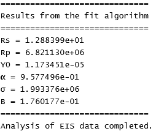
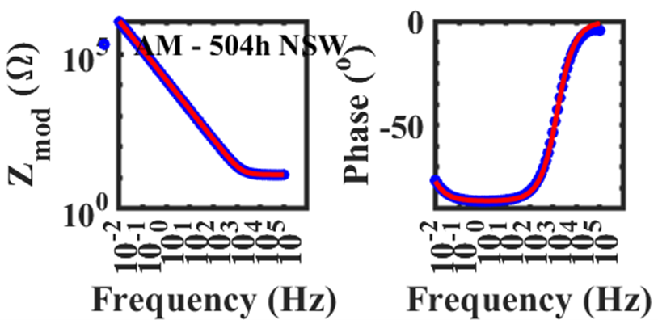

# Corrosion Modeling Applications
This repository seerves as a collection point for several different applications related to corrosion modeling.
## EIS Data Analysis
This project (found in the eis-analysis folder) was developed to facilitate the analysis of electrochemical impedance spectroscopy (EIS) data obtained from potentiostatic EIS experiments.
**Note:** The code has not been tested to determine if it works with galvanostatic EIS data.
The main function depends on files contained in the following sub-directories:
*	"Circuit Element Models"
*	"Equivalent Circuit Models"
*	"Fitting Algorithms"

Data files are expected to be found in a "Data" directory. Fit results are stored in a "Fit" directory.
All functions and classes are written in MATLAB®.

### Main Function
This function serves as the entry point for the project to analyze and fit EIS data. It can be customized depending on the physical system the EIS data was collected from, but it needs to perform the following actions:

*	Clear the command window, all figures, and all variables from the workspce.
*	Add the paths to the sub-directories containing the functions for the equivalent circuit impedance calculations and other supporting classes.
*	Create a cell array of data filenames
*	Iterate through the filenames to extract the impedance data.
*	Instantiate an instance of the eisFitController class for each datafile, pass the data to the constructor as well as the equivalent circuit type, and initial guess of the fit parameter values

Definitions for the variables in the Main function are provided below:

*	datafilenames = cell arrray containinng filenames of the raw Gamry data files
*	selectedEquivalentCircuit = character vector specifying the equivalent circuit to be used to fit the data. Available circuits are listed in the following sub-section
*	vectorOfInitialParameterEstimates = array of values for the initial parameter estimates
*	legendString = character array of the descriptions of the data to be plotted on the output plots

Available Equivalent Circuits:
Use Table 1 to specify the equivalent circuit impedance function to use in the fitting routine.  In the provided code example, it can be seen that ‘ModifiedRandles’ was the circuit that was selected.

Table 1. Available equivalent circuit impedance functions for fitting to EIS data.  The 2nd column lists the value for the selectedEquivalentCircuit class instance that is created for each datafile.  The 3rd column lists the number of initial parameter values that must be passed to the fitting function.

|Circuit Name|Name to pass to the EISFitController Instance|Number of fit parameters needed in vector|
|---|---|---|
Undamaged Coating|UndamagedCoating|3|
|Modified Undamaged Coating|ModifiedUndamagedCoating|4|
|Randles|Randles|5|
|Modified Randles|ModifiedRandles|6|
|Nested Randles Coating Defect|NestedRandlesCoatingDefect|5|
|Rapid Electrochemical Assessment of Paint (REAP)|REAP|6|
|Modified REAP|ModifiedREAP|7|

Examples of the output text with the fit parameter values and a Bode plot of the EIS data and fit are shown in Figure 1a and Figure 1b, respectively.

|a|b|
|---|---|
|||
Figure 1. a. Example output from the fitting routine. b.Bode plot of the impedance modulus vs potential oscillation frequency and the phase of the response vs the potential oscillation frequency.  Open symbols indicate data, the line indicates the fit.
## Polarization Curve Modeling
Stuff
## Pipe Spool Galvanic Couple Modeling
Stuff
## Corrosion Model 6

This application provides a shortcut for basic corrosion insight for a variety of galvanic couples between different metals, alloys, and materials.  

### Background
The origin of project grew out of the desire to provide useful corrosion information contained in unclassified, unrestricted distribution, standards that still seemed to be difficult to find if you didn't know what you were looking for.  For example, the basis of this project is: 

>MIL-STD-889C Dissimilar Metals

It was originally published in 1969 and subsequently updated in 1976 and in 2016 with a couple of minor changes and revisions in between. I have not been able to track down a copy of the original standard but the 1976 and 2016 versions are available [here](http://everyspec.com/). 

### Project Goals
This project aims to achieve the following goals:
* Provide the user with a list of different materials that can be selected to be combined into a galvanic couple
* Provide an estimate of the respective, isolated, corrosion potentials for the two materials (currently only from seawater exposure)
* Provide an estimate of the corrosion potential difference between the materials.  This provides an estimate of the overpotential available to drive corrosion, though no kinetics information is provided.

* Provide an estimate, obtained from Table 1 (see image to the right) on pg. 6 of MIL-STD-889C, of the relative compatibility of the different materials in three different environments:
  1. Marine atmopshere
  2. Seawater
  3. Industrial atmosphere
* Summarize the corrosion prevention strategies for different classes of materials as contained in Appendix A.
* Provide Windows, Android, and iOS versions of the app

### Code
This project was written in C# and XAML using Microsoft Visual Studio.  The data file used for the electrochemical potentials and material-types is written in XML.  The data file used to pull the corrosion prevention recommendations is also written in XML.  The data file used to summarize the Table I recommendations is a CSV file.

### Universal Windows Platform (UWP) App
The current version of the app is available as a free download [here](https://www.microsoft.com/store/productId/9P1L9679CFR4).  Or it can be built in Visual Studio from the source files.
